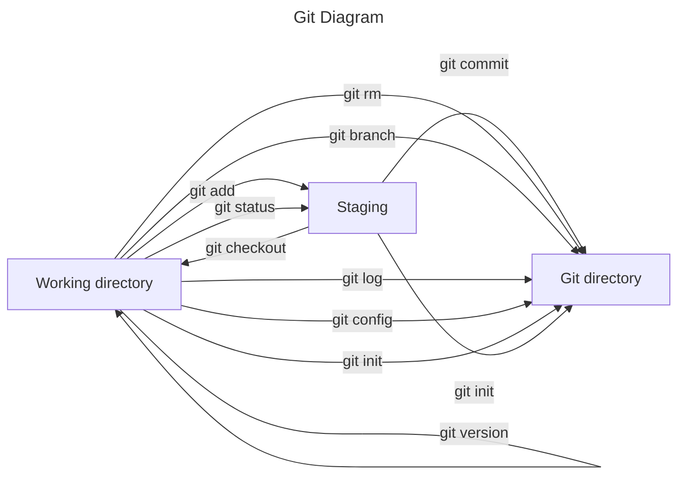

# Documentation

## Tools needed for a developer

- Code editor - [Visual Studio Code](https://code.visualstudio.com/)
  - Used to write and work with code
- Default Web Browser - [Chrome](https://www.google.com/chrome/)
  - Used for research, work with applications
- Source Control Manager - [Git](https://git-scm.com/)
  - Track code and upload to [Github](https://github.com/)
- Library - [NPM](https://www.npmjs.com/)
  - Install various frameworks
- [Node.js](https://nodejs.org/en/)
  - Example of framework
- Virtual Machine - [Oracle VirtualBox Manager](https://www.virtualbox.org/)
  - Try out programs or web applications on other machines / OS

---

## Downloaded tools in the VM

1. Entered Edge and downloaded Chrome. To then install Visual Studio Code
   - Not allowed to make @ in VM? (Proboscis a)
   - The keyboard set to english standard and not swedish
2. Signed in to my gmail account
3. Downloaded Visual Studio Code
4. Downloaded git bash
   - Logged in to Github
5. Test downloaded repository to code folder
   - Could not open test repository with command "code ."
6. Downloaded Node to then install NPM
   - It installed Chocolotaley
   - Weird error occurred?
   - Tried reinstalling node and chocolately. Didn't work
   - Gave up :)

---

## Git local commands

### List of useful Git commands

1. Git init - Initiates Git to certain repository. It can be used to convert an existing project to a Git repository

```
git init
Initialized empty Git repository in C:/code/wiki/.git/
```

For more about git init click [here](https://www.atlassian.com/git/tutorials/setting-up-a-repository/git-init)

2. Git version - Tells which version of git that is installed locally. Great to check if the current version is outdated

```
git version
git version 2.39.0.windows.2
```

For more about git init click [here](<https://confluence.atlassian.com/bitbucketserver/installing-and-upgrading-git-776640906.html#:~:text=You%20can%20check%20your%20current,or%20command%20prompt%20(Windows).>)

3. git config - sets the git either on a global or a local level. This can be anything from a username to an email.

```
git config --global user.email "your_email@example.com"
```

- Other config commands

```
$ git config --global color.ui false
```

For more about git config click [here](https://www.atlassian.com/git/tutorials/setting-up-a-repository/git-config#:~:text=The%20git%20config%20command%20is,modify%20a%20configuration%20text%20file.)

4. Git add - This command adds a change in the working directory to the staging area. This allows git to know what updates you want to include to a particular file in the following commit

```
git add <file>
```

- Other options for git add

```
git add .
```

Adds all the changed files to the staging area

For more about git add click [here](https://www.atlassian.com/git/tutorials/saving-changes#:~:text=The%20git%20add%20command%20adds,until%20you%20run%20git%20commit%20.)

5. Git status - Tells the current state of the working directory and the staging area. Shows which changes has been staged, which hasn't been staged and which files Git is tracking

```
git status
On branch main
Your branch is up to date with 'origin/main'.

Changes not staged for commit:
  (use "git add <file>..." to update what will be committed)
  (use "git restore <file>..." to discard changes in working directory)
        modified:   test.md

no changes added to commit (use "git add" and/or "git commit -a")
```

For more about git status click [here](https://www.atlassian.com/git/tutorials/inspecting-a-repository#:~:text=The%20git%20status%20command%20displays,regarding%20the%20committed%20project%20history.)

6. Git commit - makes a snapshot of the current staged changes of a project. Git won't change these changes unless Git gets asked to do so.

```
git commit
```

Other options

```
git commit -a
```

- Makes snapshot of all the changes in the working directory

```
git commit -m "messaged"
```

- Adds a message to the commit. Easier to understand the changes made.

For more bout git commit click [here](https://www.atlassian.com/git/tutorials/saving-changes/git-commit#:~:text=The%20git%20commit%20command%20captures,you%20explicitly%20ask%20it%20to.)

7. Git log - Shows the history tree of all the changes to a git repository. It will show the time and message if there is one for the commit.

```
git log
commit 5f617fe00c83d1c68bf9dedee3750ffd9c7cf3a4 (HEAD -> main, origin/main)
Author: elliotabrahamsson <112617656+elliotabrahamsson@users.noreply.github.com>
Date:   Fri Jan 13 13:38:12 2023 +0100

    Create test.md
```

For more about git log click [here](https://www.atlassian.com/git/tutorials/git-log)

8. Git branch - git branch lets you make new, list or delete branches. To switch between different branches you use git checkout therefore you use them quite close with each other

```
git branch <branch>
```

Creates a new branch (in this case called branch)

- Other options

```
git branch -d <branch>
```

- Deletes the specific branch

```
git branch -D <branch>
```

- Forces the branch to get deleted even if there is unmerged changes

For more about git branch click [here](https://www.atlassian.com/git/tutorials/using-branches#:~:text=The%20git%20branch%20command%20lets,checkout%20and%20git%20merge%20commands.)

9. Git rm - git rm removes the files from the staging area. There are two options for rm

```
git rm force
```

This deletes the file

```
git rm cache
```

This removes the file from the staging area

For more about git rm click [here](http://guides.beanstalkapp.com/version-control/common-git-commands.html)

10. Git checkout - git checkout lets you navigate between different branches that is available.

```
git checkout <name_of_branch>
```

For more about git checkout click [here](https://www.atlassian.com/git/tutorials/using-branches/git-checkout#:~:text=The%20git%20checkout%20command%20lets,new%20commits%20on%20that%20branch.)

---



---

## Git remote commands

1. Git clone - git clone lets you clone a repository from Github (remote repository) to your local machine (working directory)

```
git clone https://github.com/elliotabrahamsson/Wiki.git
```

This is very convenient when working with different people or if you work remotely between different machines

For mor about git clone click [here](https://www.atlassian.com/git/tutorials/setting-up-a-repository/git-clone#:~:text=git%20clone%20is%20primarily%20used,copies%20an%20existing%20Git%20repository.)

2. Git remote - git remote lets you make, view or delete connections towards other repositories

```
git remote add <name> <url>
```

The name can be used as a shortcut for when you need to use the repo again and the url is the link for the repo

For more about git remote click [here](https://www.atlassian.com/git/tutorials/syncing#:~:text=The%20git%20remote%20command%20lets,direct%20links%20into%20other%20repositories.)

3. Git pull - git pull downloads files from the remote repository to the working directory (your local machine)

```
git pull <remote> <branch>
```

Remote is used to merge with the specific branch

For mote about git pull click [here](https://www.atlassian.com/git/tutorials/syncing/git-pull#:~:text=The%20git%20pull%20command%20is,Git%2Dbased%20collaboration%20work%20flows.)

4. Git push - git push uploads the files from the git directory towards the remote repository. This transfers the files from your local repository to the remote repository.

```
git push <remote> <branch>
```

Pushes the specified branch along with the objects to a local branch that gets created in the destination repository.

For morea bout git push click [here](https://www.atlassian.com/git/tutorials/syncing/git-push#:~:text=The%20git%20push%20command%20is,exports%20commits%20to%20remote%20branches.)

5. Git merge - git merge combines all of the commits from different sequences into one history line.

```
# Start a new feature
git checkout -b new-feature main
# Edit some files
git add <file>
git commit -m "Start a feature"
# Edit some files
git add <file>
git commit -m "Finish a feature"
# Merge in the new-feature branch
git checkout main
git merge new-feature
```

Here is different commits between two different branches that merge into one called new-feature

For more about git push click [here](https://www.atlassian.com/git/tutorials/using-branches/git-merge#:~:text=Git%20merge%20will%20combine%20multiple,used%20to%20combine%20two%20branches.)

---

## Github

Github is a cloud based repository for your Git service. It is the main lead of collaborative Git service for both individuals and teams. It is very user friendly for both new developers and professionals can use it for separate and special needs.

<dt>What is a merge conflict?</dt>
<dd>Merge conflict is when several commits are made on the same branch and Git needs the users help to decide which commit to incorporate in the final merge </dd>

<dt>How to avoid merge conflicts?</dt>
<dd>To avoid conflicts, make sure several people don't make changes to the same file. Divide the work and files between all team members</dd>

<dt>How do you keep track of everyone's work?</dt>
<dd>The commits should describe simply what the change has done and what purpose. That way on Github everyone knows what each person has done</dd>

---

## Github credentials in VM

1.  Enter the profile settings
2.  Scroll down to Two-factor authentication (2FA)
3.  Enter your password for safety
4.  Scan the QR-code on your phone with authentication app
5.  Download the safety codes somewhere safe
6.  Done

---

## Github branch test

### Documentation of branches in git as a team

1. Cloned the new repository from Github with specifically dev branch

```
git clone --branch dev https://github.com/axelhagerback/branchtest_praktik.git
```

2. Debated with the team what changes we will make to the site

   - 2 people change the background colour of the site
   - 2 people change the text title

3. From

```
<h1 class="text-center text-4xl font-bold">TE4 Academy</h1>
```

To

```
<h1 class="text-center text-4xl font-bold">TE4 Education</h1>
```

4. Then changed branch

```
git checkout dev
```

5. Pulled the latest changes

```
git pull origin dev
```

6. Merged with new branch

```
git merge new_feature
```

7. Pushed it up to main branch

```
git push origin main
```

8. Fixed merge with commit

```
git push origin dev
```

---

## Javascript basic commands

### Variable definitions

`Var` is used for globally accessibility which you never want. It can be made to change the variables value later on.

`Let` is used when declaring a variable within a block scope such as a function loop and can only be used within. It isn't accessible outside of the block.

`Const` is used to declare unchangeable variables in the code.

### Primitives

There are 7 primitives some used more than others.

`Number` is when you use any type of numbers for a variable

`String` is when you write any type of text line in a variable

`BigInt` is used when a number is over 9 quintillion as it the takes too much data to use

`BooLean` gives out only two different options, true or false

`Symbol` came out recently and makes the value its own identity. Even if you have two of the same strings in different variables they will not be the same because of their identity.

`Undefined` is when there isn't anything assigned to that variable.

`Null` is when there isn't anything assigned to it _yet_

You can use `typeof` too identify what primitive a variable is:

```
let anka = 42;
let swan = "Kalle";
let pelican = 0b101010;
let dove;
let eagle = null;
console.log("anka: ", typeof anka);
console.log("swan: ", typeof swan);
console.log("pelican: ", typeof pelican);
console.log("dove: ", typeof dove);
console.log("eagle: ", typeof eagle);
```

```
"anka: ", "number"
"swan: ", "string"
"pelican: ", "number"
"dove: ", "undefined"
"eagle: ", "object"
```

`Array` used when you need to store data.

```
let anka = new Array("Audi", "Volvo", "BMW");
let swan = ["Seat", "Toyota", "Mazda"];
let pelican = new Array(3);
let dove  = [3];
console.log(anka);
console.log(swan);
console.log(pelican);
console.log(dove);
```

Console

```
["Audi", "Volvo", "BMW"]
["Seat", "Toyota", "Mazda"]
[undefined, undefined, undefined]
[3]
```

Arrays are made so there can't be errors but instead it gives out undefined values, because arrays are zero based.

## Properties

`Length` tells the length of, in this case the array

```
let anka = ["Audi", "BMW", "VW"];
console.log("Length: ", anka.length);
let swan = [1,2,3];
swan[7] = 42;
console.log(swan.length);
console.log(swan);
```

```
"Length: ", 3
8
[1, 2, 3, undefined, undefined, undefined, undefined, 42]
```

`Splice()` is a method that lets you add new data in the middle of an existing array.

Current array

```
let anka = ["Audi", "BMW", "VW"];
```

Then we use splice

```
anka.splice(1, 0, "Toyota", "Rover");
console.log(anka);
```

There are three parameters in splice. First is the index position or where we want to insert a value (we want it before BMW hence the 1). The second parameter is how many we want to delete which is 0 in this case. Then we add the value or values in this case and it will print out the array like this:

```
"Audi", "Toyota", "Rover", "BMW", "VW"]

```

`Concat()` is used to combine two arrays into one

```
let anka = ["Audi", "BMW", "VW"];
let swan = ["Seat", "Cupra", "Mazda"];
let pelican = anka.concat(swan);
console.log(pelican);
```

```
["Audi", "BMW", "VW", "Seat", "Cupra", "Mazda"]
```

To find something in an array you use **find()**

```
let anka = ["BMW", "VW", "Audi"];
let swan = anka.find(e => e === "VW");
let pelican = anka.find(e => e === "Toyota");
console.log(swan);
console.log(pelican);
```

```
"VW"
undefined
```

pelican is undefined because Toyota isn't part of the array

Instead of `find()` you can use `indexOf()` to find the position in the array. If a value doesn't exist it will be determined as -1 instead of undefined.

`sortOf()` will sort the array based on the alphabetical order of the words (example first audi then BMW etc)

`reverse()` will reverse the order of the array

`Classes` are used to create or sort objects and makes it easier and smoother to add new objects.

```
class Car {
    constructor(color, make, model){
        this.color = color;
        this.make = make;
        this.model = model;
    };
};

let car01 = new Car("Red", "Audi", "Q3");
let car02 = new Car("Blue", "Audi", "Q4");

console.log(car01);
console.log(car02);
```

In this case there is a `constructor` whose job is to add the new objects (this case car01 and car02) into the class if the keywords that are declared are find within the code.

This will add the new objects into our class "Car" which we then can print out with the new values.

`Methods` can also be used in a class.

```
class Person {
    constructor(firstname, lastname){
        this.firstname = firstname;
        this.lastname = lastname;
    }
    sayhello() {
        console.log("hey " + this.firstname);
    }
}

let anka = new Person("Kalle", "Anka");
console.log(anka);
anka.sayhello();
```

`properties` as well can be usd in a class which act as bi-directional. This means their value can be set and get incase you want to control what's been entered or calculated.

```
class Person {
    #firstname;
    constructor(firstname, lastname) {
        this.#firstname = firstname;
        this.lastname = lastname;
    }
    get fullname() {
        return this.#firstname + " " + this.lastname;
    }
    set firstname(firstname) {
        this.#firstname = firstname;
    }
}

let anka = new Person("Kalle", "Anka");
anka.firstname = "Arne";
console.log(anka.fullname);
```

The "#" before first and lastname is used to prevent code outside of the class to access it. The `set` makes it possible to update the firstname that we previously made unaccessible, which this is a way to control what's being sent.
The `get` makes us control what is being read from the objects like we did with `set`.
