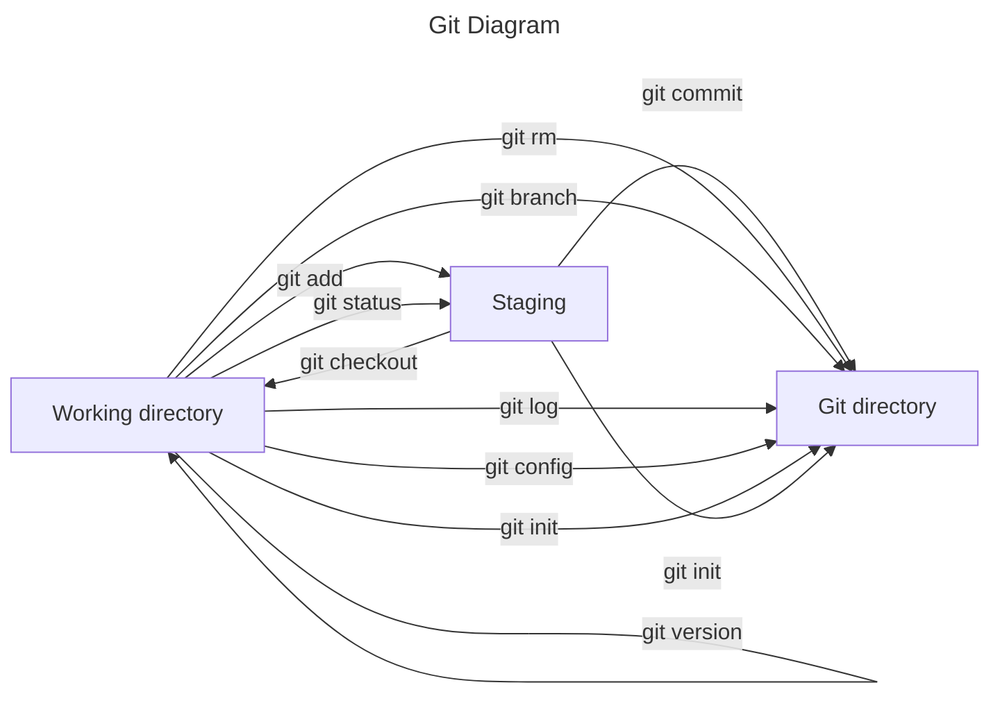

# Documentation

## Tools needed for a developer

- Code editor - [Visual Studio Code](https://code.visualstudio.com/)
  - Used to write and work with code
- Default Web Browser - [Chrome](https://www.google.com/chrome/)
  - Used for research, work with applications
- Source Control Manager - [Git](https://git-scm.com/)
  - Track code and upload to [Github](https://github.com/)
- Library - [NPM](https://www.npmjs.com/)
  - Install various frameworks
- [Node.js](https://nodejs.org/en/)
  - Example of framework
- Virtual Machine - [Oracle VirtualBox Manager](https://www.virtualbox.org/)
  - Try out programs or web applications on other machines / OS

---

## Downloaded tools in the VM

1. Entered Edge and downloaded Chrome. To then install Visual Studio Code
   - Not allowed to make @ in VM? (Proboscis a)
   - The keyboard set to english standard and not swedish
2. Signed in to my gmail account
3. Downloaded Visual Studio Code
4. Downloaded git bash
   - Logged in to Github
5. Test downloaded repository to code folder
   - Could not open test repository with command "code ."
6. Downloaded Node to then install NPM
   - It installed Chocolotaley
   - Weird error occurred?
   - Tried reinstalling node and chocolately. Didn't work
   - Gave up :)

---

## Git

### List of useful Git commands

1. Git init - Initiates Git to certain repository. It can be used to convert an existing project to a Git repository

```
git init
Initialized empty Git repository in C:/code/wiki/.git/
```

For more about git init click [here](https://www.atlassian.com/git/tutorials/setting-up-a-repository/git-init)

2. Git version - Tells which version of git that is installed locally. Great to check if the current version is outdated

```
git version
git version 2.39.0.windows.2
```

For more about git init click [here](<https://confluence.atlassian.com/bitbucketserver/installing-and-upgrading-git-776640906.html#:~:text=You%20can%20check%20your%20current,or%20command%20prompt%20(Windows).>)

3. git config - sets the git either on a global or a local level. This can be anything from a username to an email.

```
git config --global user.email "your_email@example.com"
```

- Other config commands

```
$ git config --global color.ui false
```

For more about git config click [here](https://www.atlassian.com/git/tutorials/setting-up-a-repository/git-config#:~:text=The%20git%20config%20command%20is,modify%20a%20configuration%20text%20file.)

4. Git add - This command adds a change in the working directory to the staging area. This allows git to know what updates you want to include to a particular file in the following commit

```
git add <file>
```

- Other options for git add

```
git add .
```

Adds all the changed files to the staging area

For more about git add click [here](https://www.atlassian.com/git/tutorials/saving-changes#:~:text=The%20git%20add%20command%20adds,until%20you%20run%20git%20commit%20.)

5. Git status - Tells the current state of the working directory and the staging area. Shows which changes has been staged, which hasn't been staged and which files Git is tracking

```
git status
On branch main
Your branch is up to date with 'origin/main'.

Changes not staged for commit:
  (use "git add <file>..." to update what will be committed)
  (use "git restore <file>..." to discard changes in working directory)
        modified:   test.md

no changes added to commit (use "git add" and/or "git commit -a")
```

For more about git status click [here](https://www.atlassian.com/git/tutorials/inspecting-a-repository#:~:text=The%20git%20status%20command%20displays,regarding%20the%20committed%20project%20history.)

6. Git commit - makes a snapshot of the current staged changes of a project. Git won't change these changes unless Git gets asked to do so.

```
git commit
```

Other options

```
git commit -a
```

- Makes snapshot of all the changes in the working directory

```
git commit -m "messaged"
```

- Adds a message to the commit. Easier to understand the changes made.

For more bout git commit click [here](https://www.atlassian.com/git/tutorials/saving-changes/git-commit#:~:text=The%20git%20commit%20command%20captures,you%20explicitly%20ask%20it%20to.)

7. Git log - Shows the history tree of all the changes to a git repository. It will show the time and message if there is one for the commit.

```
git log
commit 5f617fe00c83d1c68bf9dedee3750ffd9c7cf3a4 (HEAD -> main, origin/main)
Author: elliotabrahamsson <112617656+elliotabrahamsson@users.noreply.github.com>
Date:   Fri Jan 13 13:38:12 2023 +0100

    Create test.md
```

For more about git log click [here](https://www.atlassian.com/git/tutorials/git-log)

8. Git branch - git branch lets you make new, list or delete branches. To switch between different branches you use git checkout therefore you use them quite close with each other

```
git branch <branch>
```

Creates a new branch (in this case called branch)

- Other options

```
git branch -d <branch>
```

- Deletes the specific branch

```
git branch -D <branch>
```

- Forces the branch to get deleted even if there is unmerged changes

For more about git branch click [here](https://www.atlassian.com/git/tutorials/using-branches#:~:text=The%20git%20branch%20command%20lets,checkout%20and%20git%20merge%20commands.)

9. Git rm - git rm removes the files from the staging area. There are two options for rm

```
git rm force
```

This deletes the file

```
git rm cache
```

This removes the file from the staging area

For more about git rm click [here](http://guides.beanstalkapp.com/version-control/common-git-commands.html)

10. Git checkout - git checkout lets you navigate between different branches that is available.

```
git checkout <name_of_branch>
```

For more about git checkout click [here](https://www.atlassian.com/git/tutorials/using-branches/git-checkout#:~:text=The%20git%20checkout%20command%20lets,new%20commits%20on%20that%20branch.)

---



---

## Github

Github is a cloud based repository for your Git service. It is the main lead of collaborative Git service for both individuals and teams. It is very user friendly for both new developers and professionals can use it for separate and special needs.

<dt>What is a merge conflict?</dt>
<dd>Merge conflict is when several commits are made on the same branch and Git needs the users help to decide which commit to incorporate in the final merge </dd>

<dt>How to avoid merge conflicts?</dt>
<dd>To avoid conflicts, make sure several people don't make changes to the same file. Divide the work and files between all team members</dd>

<dt>How do you keep track of everyone's work?</dt>
<dd>The commits should describe simply what the change has done and what purpose. That way on Github everyone knows what each person has done</dd>

---

## Github credentials in VM

1.  Enter the profile settings
2.  Scroll down to Two-factor authentication (2FA)
3.  Enter your password for safety
4.  Scan the QR-code on your phone with authentication app
5.  Download the safety codes somewhere safe
6.  Done
